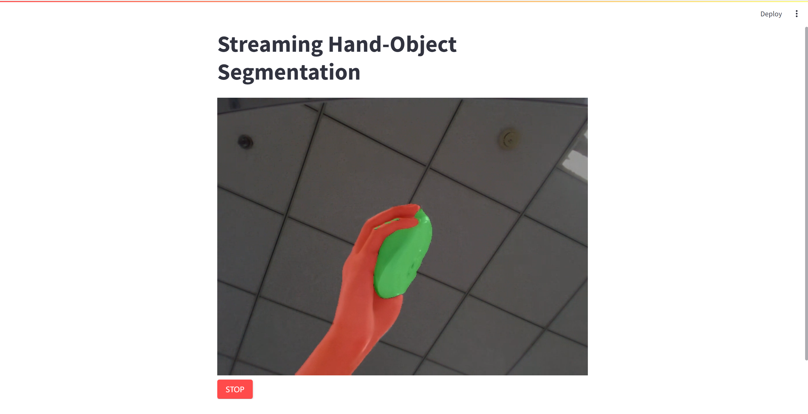

# Hand-Object Segmentation & Sample from RGB Frames

### Segmentation is Packaged from [EgoHOS](https://github.com/owenzlz/EgoHOS)
### Depth Prediction is from [ZeoDepth](https://github.com/isl-org/ZoeDepth)


## Installation 
1. Clone the repository
```bash
git clone https://github.com/hos-research/HO-Segment.git
cd HO-Segment
```

2. Setup conda environment
```bash
# conda
conda env create -f environment.yml
conda activate hosegment

# mmcv-full
pip install mmcv-full==1.6.0 -f https://download.openmmlab.com/mmcv/dist/cu116/torch1.12.0/index.html
## Try if the above command fails
pip install -U openmim
mim install mmcv-full==1.6.0
```

3. Download the pre-trained model
```bash
bash scripts/download_checkpoints.sh
```

## Interface
1. Segment Pipeline
```python
from modules import Pipeline

pipe = Pipeline(
    work_dirs: Union[str, Path], # checkpoints dirs
    device: Optional[str] = 'cuda:0' # cuda device
)

res = pipe(
    image: Union[str, Path, np.ndarray], # input image from numpy array or filename
)

res: dict({
    'hands': np.ndarray, # segment result of hands
    'objects': np.ndarray # segment result of objects
})
```

2. PointCloud Sampling
```python
from modules import Depth

depth = Depth()

depth = depth.infer(
    image: Union[np.ndarray, str, Path] # image data or filepath
)

depth: np.ndarray # float64 depth map

pcds = depth.sample(
    depth: np.ndarray, # depth image (float)
    masks: Union[np.ndarray, List[np.ndarray]] = None, # masks for sampling 
    K: Optional[np.ndarray] = None # camera intrinsic
)

pcds: List[np.ndarray] # list of points sampled with masks
```


3. Streaming
```python
from modules import Streaming

stream = Streaming(
    action: Callable, # function running on back loop
    sync: Optional[bool] = False, # synchronize the action to wait for the returned value
    limit: Optional[int] = -1 # maximum number of data in the queue
)

stream.push(
    data: Any # data to push into streaming queue
)

res = stream.get()

res: Any # result of the action running on back loop
```

## Usage

1. **Run real-time segmentation view on web**
```bash
streamlit run app.py
```  


2. **Predict segmentation from single image**
```bash
python -m scripts.predict_image --image ${path/to/input} --save ${path/to/output}

## demo: python -m scripts.predict_image --image demo/images/1.jpg --sace demo/out/1.seg.png
```


3. **Predict Hand-Object pointclouds from single image**  
```bash
python -m scripts.predict_pcd --image ${path/to/input} --save{path/to/output}

## demo: python -m scripts.predict_pcd --image demo/images/1.jpg --sace demo/out/1.pcd.png
```


4. **Predict Hand-Object pointclouds from video**  
```bash
python -m scripts.predict_pcd --video ${path/to/input} --save{path/to/output}
```